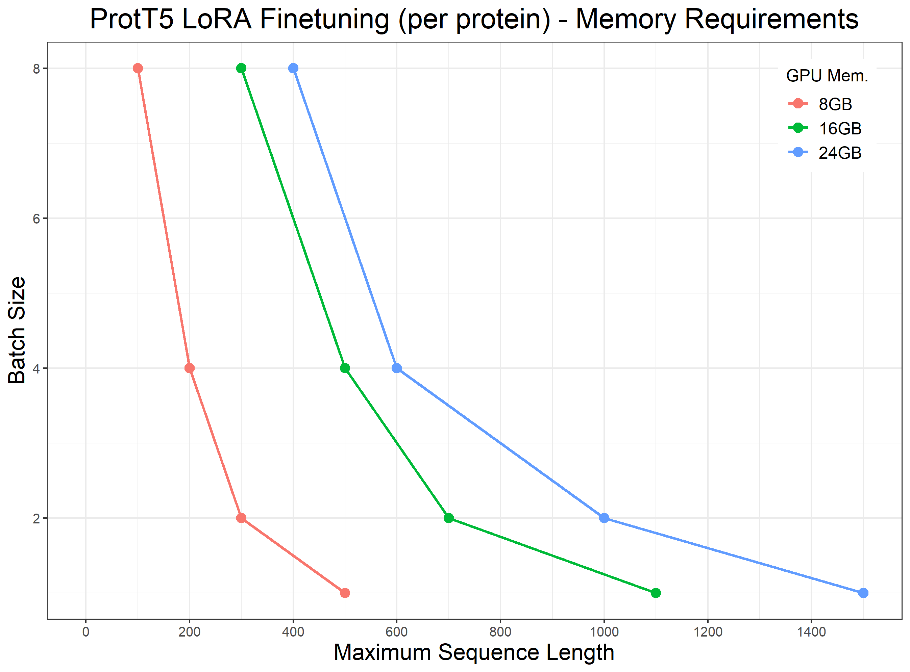

Important Notes:
----------------

1. **For easy setup of a conda environment to run the notebooks you can use the finetuning.yml File provided in this folder**

    check here for [setting up env from a yml File](https://conda.io/projects/conda/en/latest/user-guide/tasks/manage-environments.html#creating-an-environment-from-an-environment-yml-file)

2. **For details, check information inside the notebooks**

3. **Additional advice**
    - if GPU memory overflow occurs, reduce batch size to 1 and simulated the desired batch size using gradient accumulation
    - if GPU memory still overflows, use mixed percision training and/or remove(or truncate) long sequences 
    - multi GPU training is not supported by deepspeed running from a notebook. Run it in a script using [deepspeed](https://huggingface.co/docs/transformers/main_classes/deepspeed#deployment-with-multiple-gpus) or a similar distributed launcher.
  
4. **Memory Requirements**

   We show the memory requirements to run the _per protein_ notebook in dependence on the maximum sequence length and the batch size. This requires Deepspeed and Mixed-Percision training to be utilized.
   

     
    
5. **Cite**

    If you use these notebooks in your work, please cite the authors of the original PLMs you are utilizing as well as [our work](https://doi.org/10.1101/2023.12.13.571462) during which they were created.

6. **Coming soon** Ready-to-run Colab version of the pro-protein notebook for easy availability   
